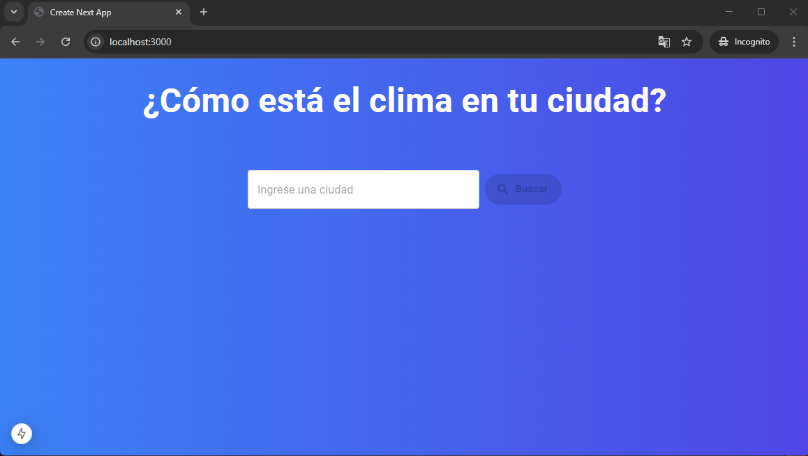
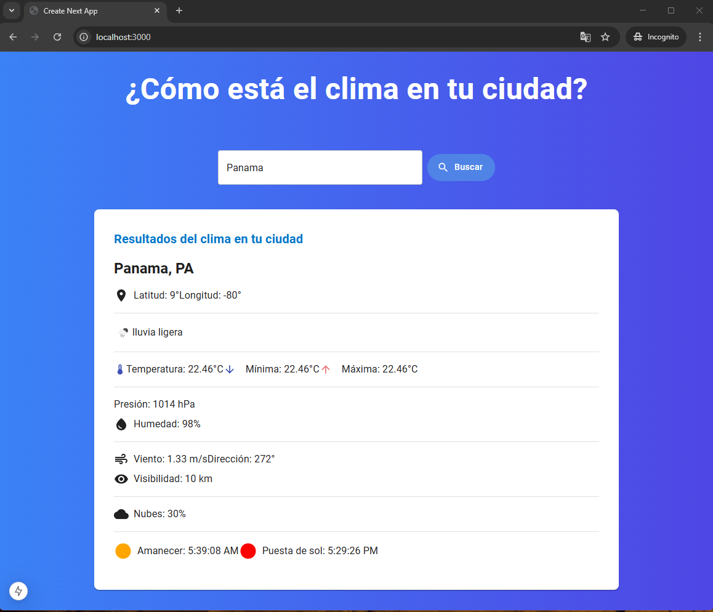
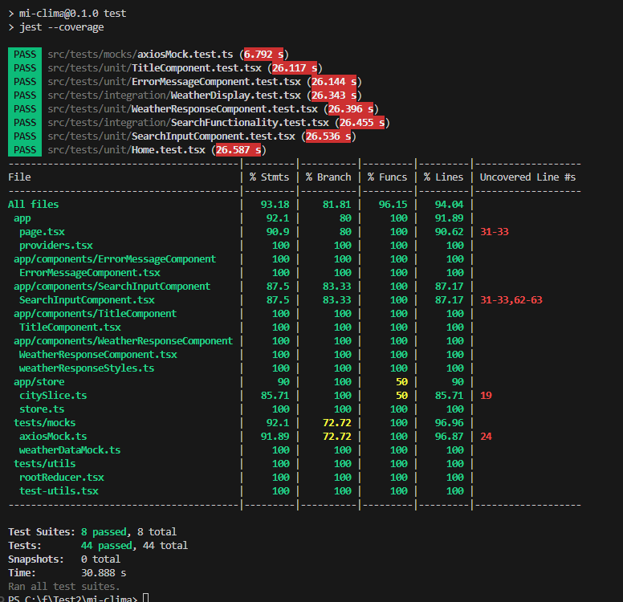

# 🌦 Mi Clima - Aplicación del Clima

 <!-- Puedes cambiar la ruta de la imagen -->

## 📌 Descripción
Mi Clima es una aplicación desarrollada con **Next.js**, **React**, **Redux Toolkit**, y **Material UI** que permite a los usuarios consultar el clima de cualquier ciudad en tiempo real.

## 🚀 Características
✅ **Búsqueda de clima por ciudad:** Ingresa el nombre de una ciudad y obtén información actualizada del clima.  
✅ **Manejo de estado global** con Redux Toolkit.  
✅ **Interfaz moderna** con Material UI.  
✅ **Manejo de errores:** Muestra mensajes adecuados cuando la ciudad no es encontrada o ocurre un error de red.
✅ **Pruebas unitarias e integradas** con Jest y Testing Library para asegurar el correcto funcionamiento de la aplicación.  
✅ **Soporte para múltiples errores** en las solicitudes de API.  


## Capturas de Pantalla

### Página principal de Mi Clima


### Error: Ciudad no encontrada


### Resultado de la búsqueda de clima


### Reporte de Test Coverage


## 📂 Estructura del Proyecto

```
mi-clima/
│── app/
│   ├── components/
│   │   ├── ErrorMessageComponent/
│   │   │   ├── ErrorMessageComponent.tsx
│   │   ├── SearchInputComponent/
│   │   │   ├── SearchInputComponent.tsx
│   │   │   ├── SearchInputComponent.styles.ts
│   │   ├── TitleComponent/
│   │   │   ├── TitleComponent.tsx
│   │   │   ├── TitleComponent.styles.ts
│   │   ├── WeatherResponseComponent/
│   │   │   ├── WeatherResponseComponent.tsx
│   │   │   ├── weatherResponseStyles.ts
│   ├── interfaces/
│   │   ├── types.ts
│   ├── services/
│   │   ├── weatherService.ts
│   ├── store/
│   │   ├── citySlice.ts
│   │   ├── store.ts
│── styles/
│   ├── globals.css
│── tests/
│   ├── setupTests.ts
│   ├── integration/
│   │   ├── SearchFunctionality.test.tsx
│   │   ├── WeatherDisplay.test.tsx
│   ├── mocks/
│   │   ├── axiosMock.ts
│   │   ├── axiosMock.test.ts
│   │   ├── weatherDataMock.ts
│   ├── unit/
│   │   ├── ErrorMessageComponent.test.tsx
│   │   ├── Home.test.tsx
│   │   ├── SearchInputComponent.test.tsx
│   │   ├── TitleComponent.test.tsx
│   │   ├── WeatherResponseComponent.test.tsx
│── .env.local
│── package.json
│── tsconfig.json
│── README.md
```

---

## 📦 Instalación

1️⃣ Clona este repositorio:

```bash
git clone https://github.com/tu-usuario/mi-clima.git
cd mi-clima
```

2️⃣ Instala las dependencias:

```bash
npm install
```

3️⃣ Configura tu API Key en `.env.local`:

```plaintext
NEXT_PUBLIC_API_KEY=TU_API_KEY
```

Asegúrate de reemplazar `TU_API_KEY` con tu clave de la API del clima.

---

## ▶️ Ejecución

Para iniciar el entorno de desarrollo:

```bash
npm run dev
```

Abra en el navegador la siguiente url:

http://localhost:3000/mi-clima

---

Para construir la aplicación para producción:

```bash
npm run build
```

Para ejecutar la aplicación en modo producción:

```bash
npm start
```

---

## 🧪 Pruebas

Ejecuta los tests unitarios e integrados con:

```bash
npm test
```

Para ejecutar las pruebas en modo observación:

```bash
npm run test:watch
```

Para obtener el reporte de cobertura de pruebas:

```bash
npm run test:coverage
```

---

## 🛠 Herramientas Utilizadas

- **Next.js** - Framework de React.
- **React 19** - Biblioteca de interfaces de usuario.
- **Redux Toolkit** - Manejo de estado global.
- **Material UI** - Componentes de UI modernos.
- **Axios** - Cliente HTTP para consumir APIs.
- **Jest & Testing Library** - Pruebas unitarias e integradas.
- **TypeScript** - Tipado estático para JavaScript.

---


```markdown

```


---

## 📄 Licencia

Este proyecto está bajo la licencia **MIT**. Puedes usarlo y modificarlo libremente.

---


## 📧 Contacto

📩 Para consultas, puedes escribirme a: [ksunami_dr@yahoo.es](mailto:ksunami_dr@yahoo.es)

---

### 🚀 ¡Gracias por usar Mi Clima! 🌤
